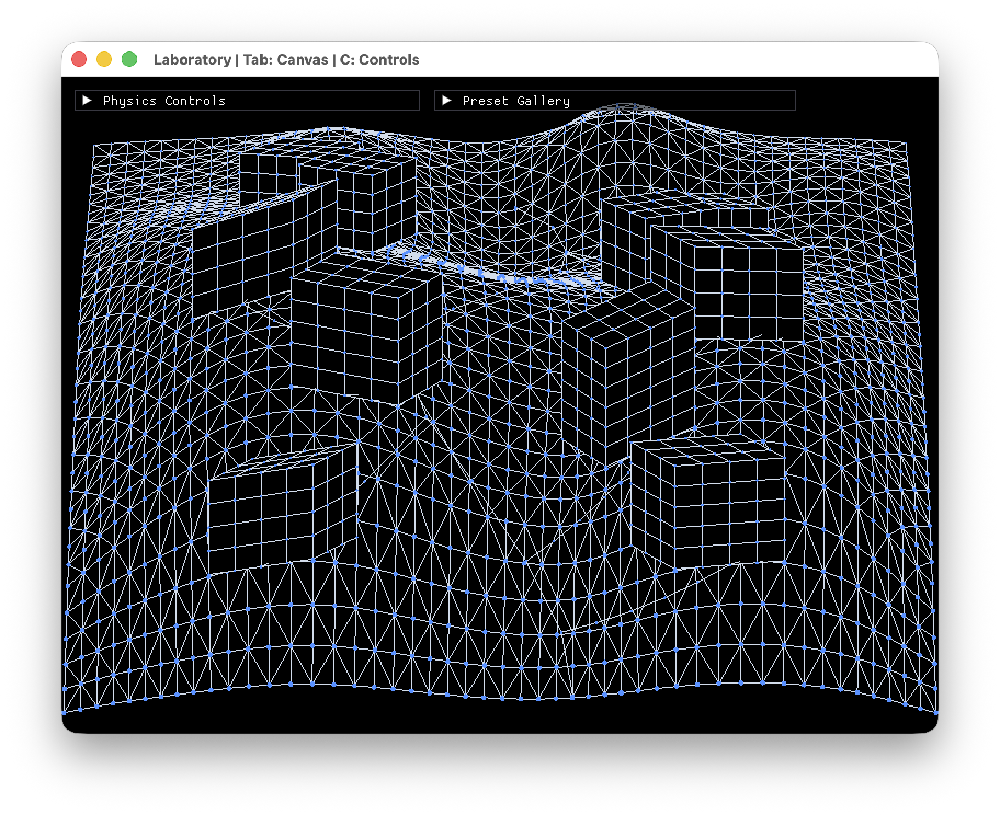
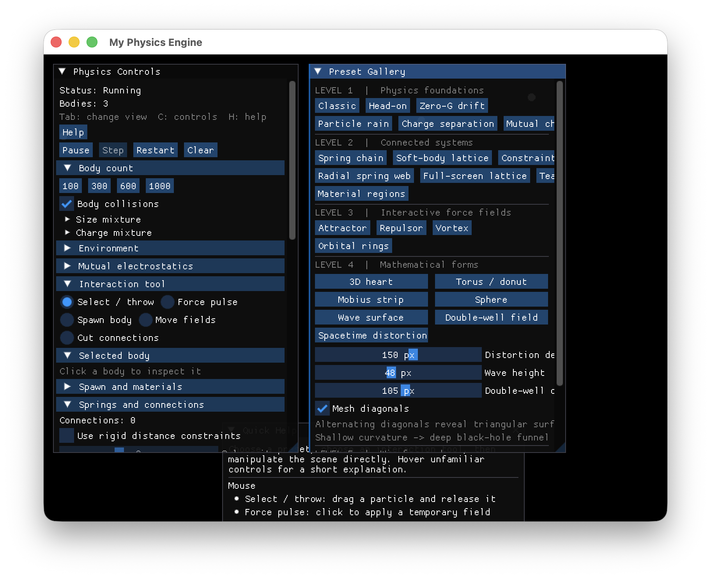
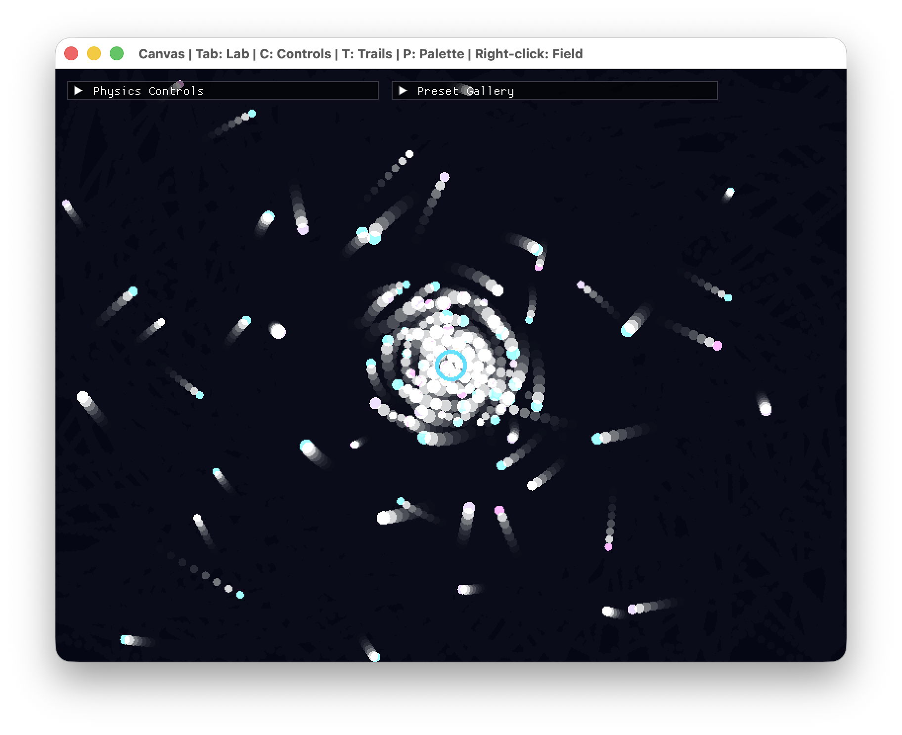
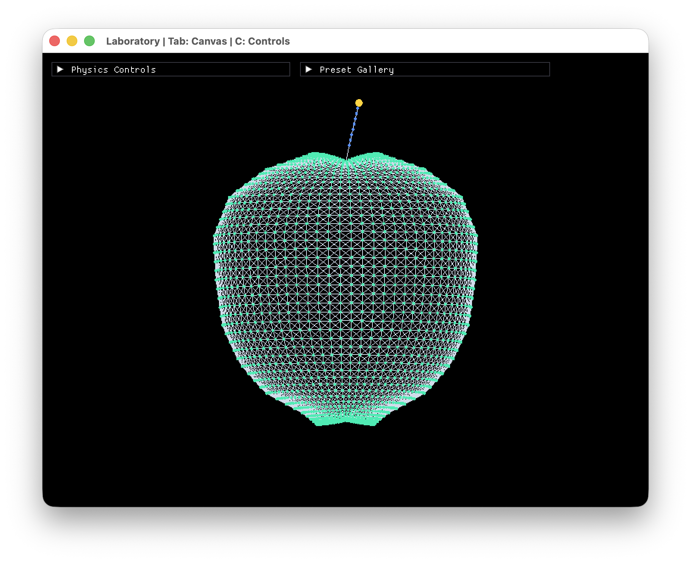
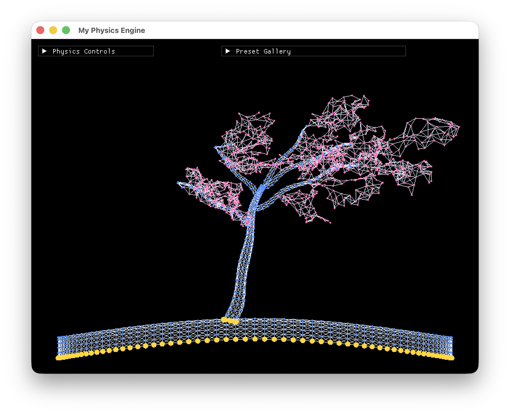
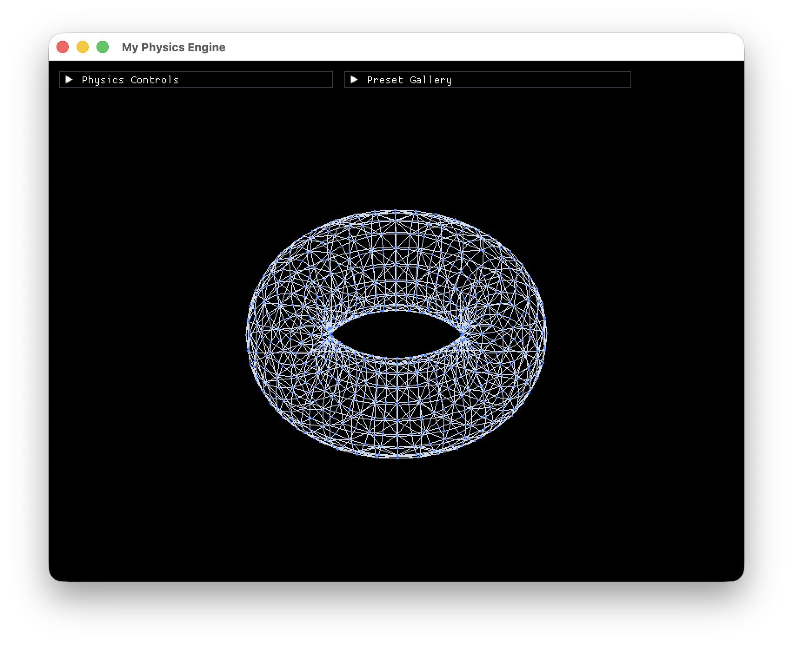
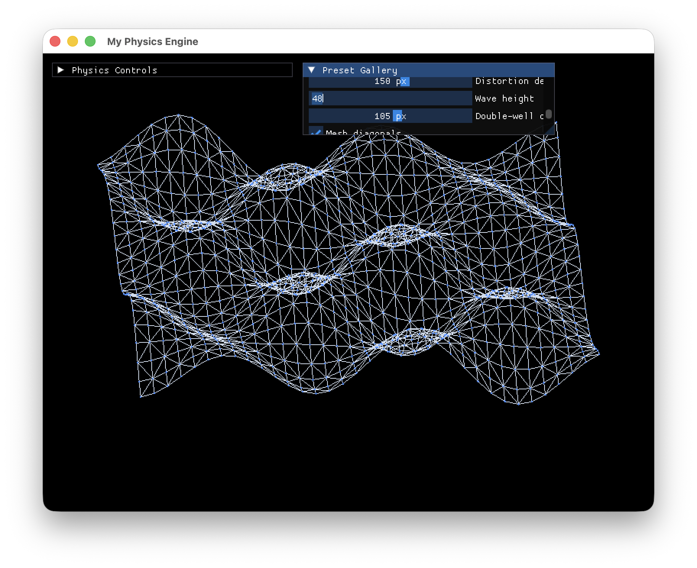
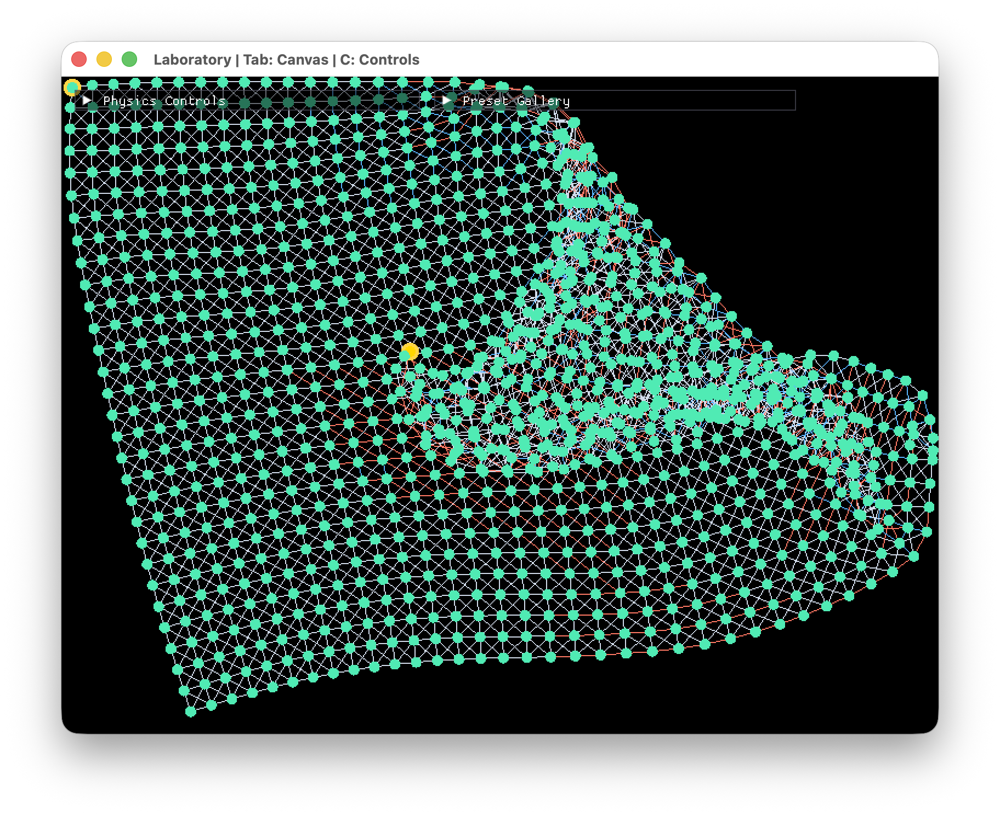
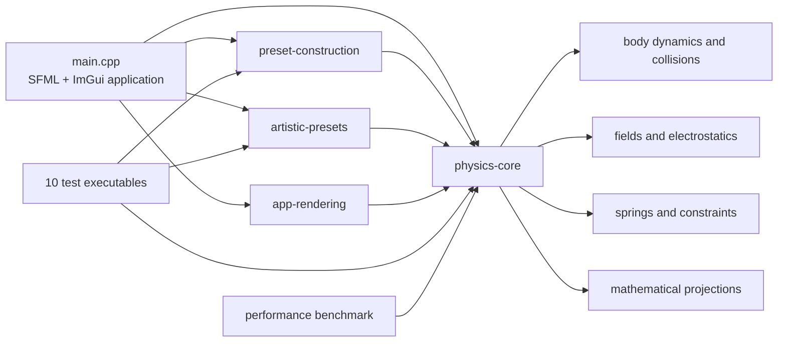

# Particle Physics Laboratory

[](https://github.com/laia-wq/physics-engine/actions/workflows/ci.yml)

An interactive 2D physics engine and generative wireframe laboratory built from
scratch in C++17. It combines rigid particles, collision algorithms, force
fields, springs, constraints, and projected mathematical surfaces to turn
physics experiments into responsive visual art.

The project deliberately uses SFML only for windows and drawing. Motion,
collisions, spatial partitioning, fields, spring forces, constraint solving,
materials, and scene construction are implemented in this repository.

## Highlights

- Fixed 120 Hz simulation independent of rendering speed
- Mass-aware circle collisions with impulse response and penetration correction
- Brute-force and uniform-grid broad phases with live diagnostics
- Gravity, aerodynamic wind, electrostatics, attractors, repulsors, vortices,
  oscillating fields, and temporary force pulses
- Hooke-law springs, iterative distance constraints, pinned particles, and
  strain-based tearing
- Structural, flexible, fragile, and fixed particle materials
- Direct manipulation: spawn, select, inspect, throw, pin, delete, connect, and cut
- Laboratory and trail-based Canvas views sharing the same controls and presets
- Projected wireframe forms and detailed deformable scenes that create apparent
  3D depth inside a 2D engine
- Ten automated test suites and a deterministic performance benchmark

## Showcase

The preset gallery is organized as a progression through the engine:

1. **Physics foundations** — collisions, zero-gravity motion, rain, and charge
2. **Connected systems** — chains, spring meshes, constraints, webs, and tearing
3. **Interactive fields** — attraction, repulsion, vortices, and orbital motion
4. **Mathematical forms** — heart, torus, Mobius strip, sphere, waves,
   double-well surface, and spacetime-distortion analogy
5. **Wireframe artwork** — particle apple, windblown tree, and rolling terrain
   with depth-ordered buildings and paths

See [the preset guide](docs/presets.md) for what every scene demonstrates.

### Visual showcase

| Wireframe city | Interactive laboratory |
|---|---|
|  |  |

| Interactive vector field | Particle-mesh apple |
|---|---|
|  |  |

| Windblown tree | Mathematical torus |
|---|---|
|  |  |

| Adjustable wave surface | Strain-based lattice tearing |
|---|---|
|  |  |

## Build from source

Requirements:

- Apple silicon or Intel Mac
- C++17-compatible compiler (Apple Clang is included with Xcode Command Line Tools)
- CMake 3.22 or newer
- SFML 3

Install the build tools with [Homebrew](https://brew.sh/):

```sh
xcode-select --install
brew install cmake sfml
```

Build and run:

```sh
git clone https://github.com/laia-wq/physics-engine.git
cd physics-engine
cmake -S . -B build -DCMAKE_BUILD_TYPE=Release
cmake --build build -j4
./build/physics-engine
```

CMake downloads the pinned Dear ImGui and ImGui-SFML versions during the first
configuration. They provide interface widgets but do not provide simulation
physics.

## Controls

| Input | Action |
|---|---|
| Left drag | Use the selected interaction tool |
| `Tab` | Switch between Laboratory and Canvas |
| `C` | Show or hide both main control windows |
| `H` | Show or hide Quick Help |
| `Space` | Pause or resume |
| `N` | Advance one physics step while paused |
| `R` | Restart the current preset |
| `Delete` / `Backspace` | Delete the selected particle |
| `T` | Toggle Canvas trails |
| `P` | Cycle Canvas colour palettes |

The full interaction and interface reference is in
[the controls guide](docs/controls.md). On macOS, use `Command-Shift-5` to record
or capture a clean scene after hiding controls with `C`.

## Architecture



- `main.cpp` coordinates user input, controls, simulation timing, and display.
- `physics-core` contains the reusable physics algorithms and body state.
- `preset-construction` builds foundational and connected experiments.
- `artistic-presets` builds the windblown-tree and rolling-terrain showcases.
- `app-rendering` draws particles, springs, and depth-ordered buildings.

Keeping simulation, scene construction, and rendering separate makes the engine
easier to understand and allows its physics and presets to be tested without
opening a graphical window.

## Testing

```sh
cmake -S . -B build -DCMAKE_BUILD_TYPE=Release
cmake --build build -j4
ctest --test-dir build --output-on-failure
```

The suites cover collisions, body integration and bounds, spatial partitioning,
electrostatics, point fields, damped springs, iterative constraints, preset
restart behavior, and the two most complex artistic scene generators.

## Performance

The deterministic collision-search benchmark verifies that the uniform grid
finds the same contacts as exhaustive search before recording timing results.
On the development Mac, the grid reduced 499,500 possible pairs to 1,957
candidates at 1,000 particles and completed the search **2.62x faster**.

```sh
./build/performance-benchmark
```

See [the benchmark methodology and full results](docs/performance.md).

## Engineering documentation

- [Controls guide](docs/controls.md)
- [Preset and concept guide](docs/presets.md)
- [Performance methodology](docs/performance.md)
- [Engineering log](docs/engineering-log.md)

The engineering log records design decisions, failed approaches, stability
problems, performance evidence, and the reasoning behind major revisions.

## Project status

Feature development and macOS packaging are complete for the first portfolio
release. The documented release candidate has passed the automated test suite,
benchmark validation, application-signature verification, and ZIP integrity
check. It is ready to publish as version 1.0.0.
